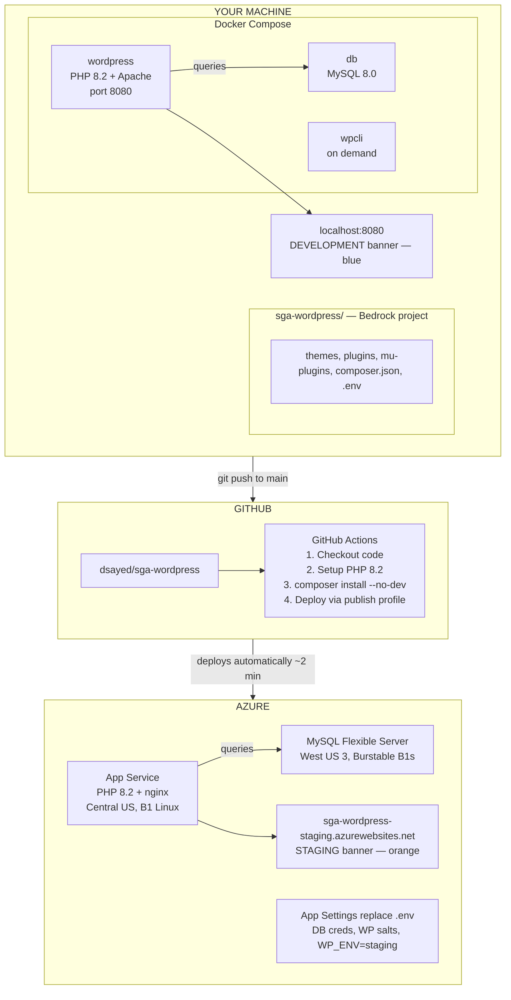

# SGA WordPress

Public website for [Saving Great Animals](https://savinggreatanimals.org), a dog rescue in Seattle.

## Quick Start (first time only)

1. Install [Docker Desktop](https://www.docker.com/products/docker-desktop/) if you don't have it
2. Open Docker Desktop and wait for it to finish starting (whale icon in menu bar stops animating)
3. Run these commands in Terminal:

```bash
git clone https://github.com/dsayed/sga-wordpress.git
cd sga-wordpress
cp .env.example .env
docker compose up -d --build
docker compose run --rm -v $(pwd)/scripts:/scripts --entrypoint sh wpcli /scripts/setup.sh
```

4. Open http://localhost:8080 — you should see the site with a blue DEVELOPMENT banner
5. Admin: http://localhost:8080/wp/wp-admin (username: **admin**, password: **admin**)

## Local Development

### Starting your dev session

1. **Open Docker Desktop** (from Applications or Spotlight). Wait for it to finish starting.
2. **Start the containers:**
   ```bash
   cd ~/repos/sga-wordpress
   docker compose up -d
   ```
3. **Open** http://localhost:8080

That's it. Your database and content are still there from last time.

### Stopping your dev session

When you're done working on the WordPress site:

```bash
docker compose down              # Stops containers, keeps your database
```

Then **quit Docker Desktop** (right-click the whale icon in the menu bar → Quit, or Cmd+Q). This frees up ~400-500MB of RAM. You only need Docker Desktop running when working on the WordPress site.

> **Warning:** `docker compose down -v` (with `-v`) **deletes your database**. Only use this if you want a completely fresh start. Without `-v`, your content is safe.

### What's running

`docker compose up -d` starts three containers:

| Container | Image | Purpose |
|-----------|-------|---------|
| **db** | MySQL 8.0 | WordPress database (`sga_wordpress`) |
| **wordpress** | PHP 8.2 + Apache (custom Dockerfile) | Serves WordPress from Bedrock's `web/` directory |
| **wpcli** | wordpress:cli | WP-CLI commands (runs on demand, not persistent) |

The setup script (`scripts/setup.sh`) installs WordPress with these defaults:
- Admin credentials: **admin / admin**
- Site title: "Saving Great Animals"
- Theme: Twenty Twenty-Five
- Timezone: America/Los_Angeles
- Permalinks: `/%postname%/`

A blue **DEVELOPMENT** banner appears at the top of both the site and admin dashboard.

### Viewing logs

```bash
docker compose logs wordpress    # View WordPress/Apache logs
docker compose logs db           # View MySQL logs
```

### WP-CLI

All WP-CLI commands need `--path=/var/www/html/web/wp` because Bedrock nests WordPress under `web/wp/`:

```bash
docker compose run --rm wpcli theme list --path=/var/www/html/web/wp
docker compose run --rm wpcli plugin list --path=/var/www/html/web/wp
docker compose run --rm wpcli user list --path=/var/www/html/web/wp
```

### Fresh start

To wipe the database and reinstall from scratch:

```bash
docker compose down -v
docker compose up -d --build
docker compose run --rm -v $(pwd)/scripts:/scripts --entrypoint sh wpcli /scripts/setup.sh
```

### File structure

Theme and plugin files live under `web/app/` (not the default `wp-content/`):

```
web/
├── app/
│   ├── themes/          # Themes (Composer-managed)
│   ├── plugins/         # Plugins (Composer-managed)
│   └── mu-plugins/      # Must-use plugins (auto-loaded, no activation needed)
├── wp/                  # WordPress core (Composer-managed, don't edit)
└── index.php            # Front controller
```

Changes to theme/plugin files take effect immediately — no container restart needed.

## Architecture



### How the pieces fit together

**[Bedrock](https://roots.io/bedrock/)** is a WordPress boilerplate by Roots that treats WordPress like a modern application. Instead of downloading WordPress and dumping plugins into `wp-content/`, Bedrock manages everything through Composer (PHP's package manager). WordPress core, themes, and plugins are all declared as dependencies in `composer.json`. This means the entire stack is version-controlled and reproducible — anyone can clone the repo and get an identical environment.

**Docker Compose** runs the local development environment. It spins up a MySQL database and a PHP web server as isolated containers. Your project files are mounted into the WordPress container, so edits show up instantly without rebuilding. The `wpcli` container exists only to run administrative commands (install plugins, reset passwords, etc.) and exits immediately after each command.

**GitHub Actions** handles continuous deployment. When you push to `main`, a workflow checks out the code, installs Composer dependencies (without dev packages), and deploys the result to Azure. The whole pipeline takes about 2 minutes. Authentication uses a publish profile stored as a GitHub secret — no Azure credentials in the repo.

**Azure App Service** hosts the staging site. It runs PHP 8.2 on Linux with nginx (not Apache like local). A custom `nginx.conf` in the repo sets the document root to Bedrock's `web/` directory. Database credentials and WordPress salts are stored as App Settings (Azure's equivalent of environment variables), following the [twelve-factor app](https://12factor.net/config) principle of keeping config out of code.

**Local and Azure are independent environments.** They have separate databases with separate content. The environment banner — blue for development, orange for staging — makes it obvious which environment you're looking at.

## Azure Staging

Staging site: https://sga-wordpress-staging.azurewebsites.net

### First-time setup

```bash
# Install Azure CLI and login
brew install azure-cli
az login
az account set --subscription b5c4e6b0-e93e-47b8-ab37-1197d84b0064

# Create resource group and deploy infrastructure
az group create --name rg-sga --location westus2
./infrastructure/deploy.sh

# Get publish profile and add as GitHub secret
az webapp deployment list-publishing-profiles --name sga-wordpress-staging --resource-group rg-sga --xml
# Copy output → GitHub repo → Settings → Secrets → AZURE_WEBAPP_PUBLISH_PROFILE
```

### Deploy

Push to `main` — GitHub Actions builds and deploys automatically.

### Save costs

```bash
./scripts/azure-stop.sh    # Stop resources (~$0/month when stopped)
./scripts/azure-start.sh   # Start back up
```

## Related

- [Organizational personas and development approach](https://github.com/dsayed/sga-community/blob/main/docs/plans/2026-02-21-sga-org-personas.md)
- [Design and accessibility assessment](https://github.com/dsayed/sga-community/blob/main/docs/plans/2026-02-17-sga-website-design-assessment.md)
